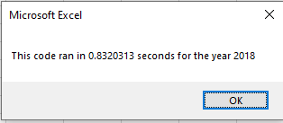

# Stock-Analysis

You can find the Analysis file here: [VBA Challenge - Stock Analysis](https://github.com/NedaAJ/stock-analysis/blob/main/VBA_Challenge.xlsm)

## Overview of Project
### Purpose
The purpose of this project is to refactor the existing Microsoft VBA code in a way that we can collect **any** stocks information in either of _2018_ or _2017_ years to understand if the stocks are worth investing. This process was already done in a format which worked perfectly for dozen of stocks; however, the goal of this challenge is to increase the effeciency of our existing code.

## Results
### Analysis
I began with copying the starter code provided with the challenge guideline and edited the sections numbered as following:

    '1a) Create a ticker Index
    tickerIndex = 0

    '1b) Create three output arrays
    Dim tickerVolumes(12) As Long
    Dim tickerStartingPrices(12) As Single
    Dim tickerEndingPrices(12) As Single
    
    
    ''2a) Create a for loop to initialize the tickerVolumes to zero.
    For i = 0 To 11
    
        tickerVolumes(i) = 0
        tickerStartingPrices(i) = 0
        tickerEndingPrices(i) = 0
        
    Next i
        
        
    ''2b) Loop over all the rows in the spreadsheet.
    For i = 2 To RowCount
    
        '3a) Increase volume for current ticker
        tickerVolumes(tickerIndex) = tickerVolumes(tickerIndex) + Cells(i, 8).Value
        
        
        '3b) Check if the current row is the first row with the selected tickerIndex.
                   
        If Cells(i, 1).Value = tickers(tickerIndex) And Cells(i - 1, 1).Value <> tickers(tickerIndex) Then
                
                tickerStartingPrices(tickerIndex) = Cells(i, 6).Value
            
        End If
        
        '3c) check if the current row is the last row with the selected ticker
         'If the next row’s ticker doesn’t match, increase the tickerIndex.
        
        If Cells(i + 1, 1).Value <> tickers(tickerIndex) And Cells(i, 1).Value = tickers(tickerIndex) Then
                
                tickerEndingPrices(tickerIndex) = Cells(i, 6).Value
            
        End If
            

            '3d Increase the tickerIndex.
            
            If Cells(i, 1).Value = tickers(tickerIndex) And Cells(i + 1, 1).Value <> tickers(tickerIndex) Then
                
                tickerIndex = tickerIndex + 1
                     
            End If
    
    Next i
    
    '4) Loop through your arrays to output the Ticker, Total Daily Volume, and Return.
    For i = 0 To 11
        
        Worksheets("All Stocks Analysis").Activate
        Cells(4 + i, 1).Value = tickers(i)
        Cells(4 + i, 2).Value = tickerVolumes(i)
        Cells(4 + i, 3).Value = tickerEndingPrices(i) / tickerStartingPrices(i) - 1   
        
    Next i

Here is the results of our analysis for both years:

Based on the results, almost all stocks had a significant drop down in their returns for the year 2018. However, we can say that the stock with ticker name **ENPH** had a great return for both years, therefore, this could be a great stock for Steve's parents to invest in.

## Summary

1. What are the advantages or disadvantages of refactoring code?
The greatest advatange was the decrease in our macro run time. Based on screenshots below, you can see that the original macro run time was 0.8 second for both years:

However, once we did the refactoring, the macro took only **0.2 seconds** to run which is a great improvement and what actually our client was looking for. Here are screenshots of the run time in our new refactored analysis:

2. How do these pros and cons apply to refactoring the original VBA script?
Refactoring has number of different pros. Not only it makes a cleaner and more organized code but also can be benefitial for other collaborators who might read our codes because of how straightforward and easy it is to follow and read. It will be also easier to debug and can increase our softwares effeciency. On the other hand, the refactoring can be really time consuming. For this challenge, we did not have as many lines of codes therefore it did not take much of a time but in real world and projects, we might have hundreds of code lines. There can be also a higher chance of mistakes because of complexity of the code.
